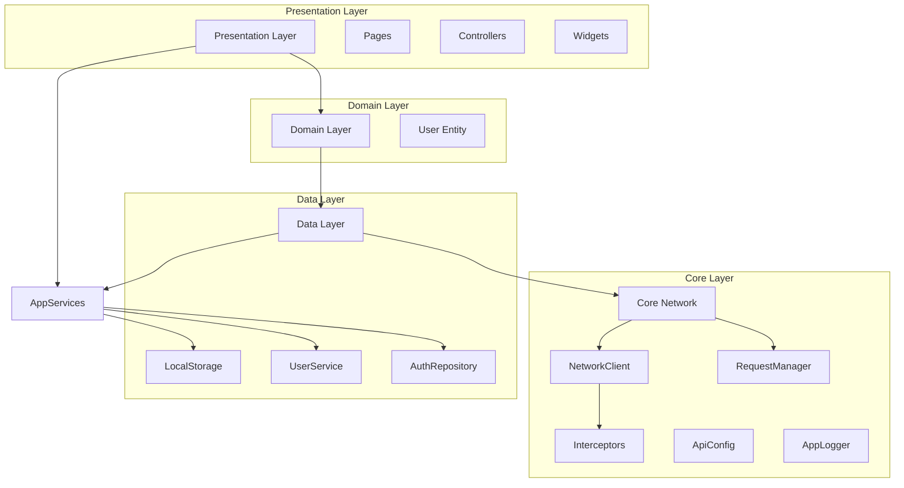
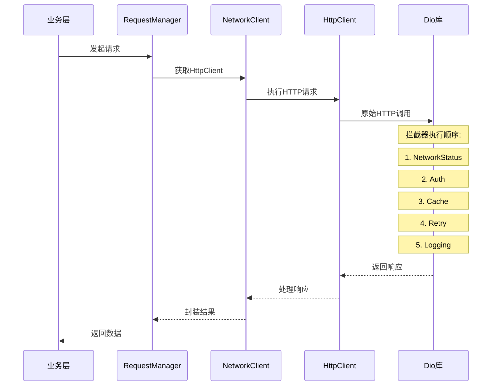
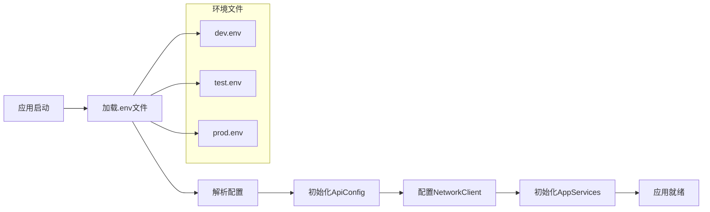

# Flutter Clean Architecture 框架概要

**创建时间**: 2025年8月9日  
**最后修改**: 2025年8月9日  
**版本**: v1.0.0

## 更改记录

| 时间 | 版本 | 修改内容 | 修改人 |
|------|------|----------|--------|
| 2025-08-09 | v1.0.0 | 初始架构文档创建 | Flutter架构师 |

---

## 1. 项目概述

奇奇漫游记（qiqimanyou）采用 **Clean Architecture** 分层架构设计，结合 Flutter 最佳实践，实现了高内聚、低耦合的代码结构。项目摒弃了复杂的依赖注入框架，采用简洁的单例模式进行服务管理，提升了代码的可读性和可维护性。

### 1.1 核心设计理念

- **简洁性优先**: 代码干净，避免过度设计
- **可读性第一**: 命名清晰，结构一目了然  
- **职责清晰**: 每个类只负责一个明确的功能
- **完全解耦**: 业务代码与基础设施完全分离

---

## 2. 架构分层

```
┌─────────────────────────────────────────┐
│             Presentation Layer          │  ← UI层：页面、控制器、组件
├─────────────────────────────────────────┤
│              Domain Layer               │  ← 领域层：实体、业务规则
├─────────────────────────────────────────┤
│               Data Layer                │  ← 数据层：仓库、服务、API
├─────────────────────────────────────────┤
│               Core Layer                │  ← 核心层：网络、配置、工具
└─────────────────────────────────────────┘
```

### 2.1 表现层 (Presentation Layer)
- **页面 (Pages)**: 用户界面组件
- **控制器 (Controllers)**: GetX状态管理
- **组件 (Widgets)**: 可复用UI组件

### 2.2 领域层 (Domain Layer)  
- **实体 (Entities)**: 业务核心对象
- **用例 (Use Cases)**: 业务逻辑封装

### 2.3 数据层 (Data Layer)
- **仓库 (Repositories)**: 数据访问抽象
- **服务 (Services)**: 具体数据源实现
- **模型 (Models)**: 数据传输对象

### 2.4 核心层 (Core Layer)
- **网络框架**: 统一的HTTP请求管理
- **配置管理**: 多环境配置支持
- **工具类**: 通用功能组件
- **常量定义**: 应用常量集中管理

---

## 3. 核心框架组件

### 3.1 🌐 网络层框架

#### 3.1.1 ApiConfig - API配置管理
```dart
class ApiConfig {
  static ApiConfig get instance => _instance;
  
  // 支持多环境配置
  static void initDev();    // 开发环境
  static void initTest();   // 测试环境  
  static void initProd();   // 生产环境
}
```

**核心功能:**
- 多环境配置支持
- 超时时间管理
- 请求头配置
- 日志控制开关

#### 3.1.2 NetworkClient - 网络客户端
```dart
class NetworkClient {
  static NetworkClient get instance => _instance;
  
  // HTTP客户端访问
  HttpClient get httpClient;
  
  // 拦截器管理
  void addInterceptor(Interceptor interceptor);
  T? getInterceptor<T extends Interceptor>();
}
```

**设计特点:**
- 🔌 **拦截器架构**: 认证、重试、缓存、日志等功能模块化
- 🔒 **单例模式**: 全局唯一实例，确保配置一致性
- 📁 **分层设计**: NetworkClient → HttpClient → Dio

#### 3.1.3 RequestManager - 请求管理器
```dart
class RequestManager {
  static RequestManager get instance => _instance;
  
  // HTTP方法
  Future<T> get<T>(String path, ...);
  Future<T> post<T>(String path, {dynamic data, ...});
  Future<T> put<T>(String path, ...);
  Future<T> delete<T>(String path, ...);
  Future<T> patch<T>(String path, ...);
  
  // 文件操作
  Future<T> upload<T>(String path, FormData formData, ...);
  Future<void> download(String urlPath, String savePath, ...);
  
  // 认证管理
  void setAuthToken(String token);
  void clearAuthToken();
}
```

**核心优势:**
- 🎯 **业务友好**: 直接返回数据，统一错误处理
- 🔄 **完整HTTP支持**: GET/POST/PUT/DELETE/PATCH
- 📁 **文件处理**: 上传下载，进度回调
- 🔐 **认证集成**: Token自动管理

### 3.2 🏗️ 服务管理框架

#### 3.2.1 AppServices - 统一服务管理器
```dart
class AppServices {
  static AppServices get instance => _instance;
  
  // 核心服务访问器
  LocalStorageService get localStorage;
  UserService get userService;
  AuthRepository get authRepository;
  VocabularyRepository get vocabularyRepository;
}
```

**设计优势:**
- 🎯 **直观访问**: `AppServices.instance.userService`
- 🚀 **懒加载**: 服务在首次使用时创建
- 🔄 **易测试**: 支持服务重置和Mock
- 📝 **类型安全**: IDE完整代码提示

### 3.3 🔗 拦截器系统

#### 3.3.1 认证拦截器 (AuthInterceptor)
```dart
class AuthInterceptor extends Interceptor {
  void setToken(String token);
  void clearToken();
  
  @override
  void onRequest(RequestOptions options, RequestInterceptorHandler handler);
}
```

#### 3.3.2 缓存拦截器 (CacheInterceptor)  
```dart
class CacheInterceptor extends Interceptor {
  void clearAllCache();
  Map<String, dynamic> getCacheStats();
  
  // 工厂方法
  factory CacheInterceptor.shortTerm(); // 30个缓存项
  factory CacheInterceptor.longTerm();  // 100个缓存项
}
```

#### 3.3.3 重试拦截器 (RetryInterceptor)
```dart
class RetryInterceptor extends Interceptor {
  final int maxRetries;
  final Duration retryDelay;
  
  @override
  void onError(DioError err, ErrorInterceptorHandler handler);
}
```

#### 3.3.4 日志拦截器 (LoggingInterceptor)
```dart
class LoggingInterceptor extends Interceptor {
  // 工厂方法  
  factory LoggingInterceptor.simple();   // 基础日志
  factory LoggingInterceptor.verbose();  // 详细日志
}
```

### 3.4 📱 应用生命周期管理

#### 3.4.1 AppInitializer - 应用初始化器
```dart
class AppInitializer {
  static Future<void> initialize() async {
    // 1. 确保Flutter绑定初始化
    WidgetsFlutterBinding.ensureInitialized();
    
    // 2. 设置系统UI样式
    _setSystemUIOverlayStyle();
    
    // 3. 初始化应用服务
    await AppServices.instance.initialize();
    
    // 4. 初始化UI组件
    _initializeUI();
  }
}
```

### 3.5 📝 日志系统

#### 3.5.1 AppLogger - 应用日志管理器
```dart
class AppLogger {
  static void verbose(String message, [dynamic error, StackTrace? stackTrace]);
  static void debug(String message, [dynamic error, StackTrace? stackTrace]);
  static void info(String message, [dynamic error, StackTrace? stackTrace]);
  static void warning(String message, [dynamic error, StackTrace? stackTrace]);  
  static void error(String message, [dynamic error, StackTrace? stackTrace]);
  static void wtf(String message, [dynamic error, StackTrace? stackTrace]);
}
```

**特性:**
- 🎨 **美化输出**: emoji、颜色、时间戳
- 🔍 **错误追踪**: 支持堆栈跟踪
- ⚙️ **可配置**: 支持不同日志级别

---

## 4. 依赖库说明

### 4.1 核心依赖

| 库名 | 版本 | 用途 | 文档链接 |
|------|------|------|----------|
| **flutter** | SDK | Flutter核心框架 | [Flutter.dev](https://flutter.dev) |
| **get** | 4.6.5 | 状态管理、路由、依赖注入 | [GetX](https://github.com/jonataslaw/getx) |
| **dio** | 4.0.6 | HTTP客户端 | [Dio](https://github.com/flutterchina/dio) |
| **logger** | 1.4.0 | 日志管理 | [Logger](https://pub.dev/packages/logger) |

### 4.2 存储相关

| 库名 | 版本 | 用途 |
|------|------|------|
| **shared_preferences** | 2.2.2 | 简单键值存储 |
| **flutter_secure_storage** | 7.0.1 | 安全存储(Token等敏感信息) |

### 4.3 网络相关

| 库名 | 版本 | 用途 |
|------|------|------|
| **connectivity_plus** | 3.0.6 | 网络连接状态检测 |
| **dio** | 4.0.6 | HTTP请求客户端 |

### 4.4 UI相关

| 库名 | 版本 | 用途 |
|------|------|------|
| **flutter_easyloading** | 3.0.5 | 加载指示器 |
| **flutter_screenutil** | 5.7.0 | 屏幕适配 |

---

## 5. 文件结构

```
lib/
├── core/                        # 核心层
│   ├── network/                 # 网络框架
│   │   ├── api_config.dart      # API配置
│   │   ├── network_client.dart  # 网络客户端
│   │   ├── request_manager.dart # 请求管理器
│   │   ├── http_client.dart     # HTTP客户端
│   │   ├── network_exceptions.dart # 网络异常
│   │   ├── network.dart         # 统一导出
│   │   └── interceptors/        # 拦截器目录
│   │       ├── auth_interceptor.dart
│   │       ├── cache_interceptor.dart
│   │       ├── retry_interceptor.dart
│   │       ├── logging_interceptor.dart
│   │       └── network_status_interceptor.dart
│   ├── services/                # 服务管理
│   │   ├── app_services.dart    # 应用服务管理器
│   │   └── services.dart        # 便捷导出
│   ├── config/                  # 配置管理
│   │   ├── env_config.dart      # 环境配置
│   │   └── environment_config.dart # 环境配置类
│   ├── constants/               # 常量定义
│   │   ├── app_constants.dart   # 应用常量
│   │   └── api_endpoints.dart   # API端点
│   ├── exceptions/              # 异常定义
│   │   └── app_exceptions.dart  # 应用异常
│   ├── logging/                 # 日志系统
│   │   └── app_logger.dart      # 日志管理器
│   ├── utils/                   # 工具类
│   └── app_initializer.dart     # 应用初始化器
├── data/                        # 数据层
│   ├── repositories/            # 仓库实现
│   │   ├── auth_repository.dart
│   │   └── vocabulary_repository.dart
│   └── services/                # 数据服务
│       ├── local_storage_service.dart
│       └── user_service.dart
├── domain/                      # 领域层
│   └── entities/                # 业务实体
│       └── user.dart
├── presentation/                # 表现层
│   ├── controllers/             # GetX控制器
│   │   ├── home_controller.dart
│   │   └── network_test_controller.dart
│   ├── pages/                   # 页面
│   │   ├── home_page.dart
│   │   └── welcome_page.dart
│   └── widgets/                 # 组件
│       ├── vocabulary_tab.dart
│       └── profile_tab.dart
├── config/                      # 环境配置文件
│   ├── dev.env                  # 开发环境
│   ├── test.env                 # 测试环境
│   └── prod.env                 # 生产环境
└── main.dart                    # 应用入口
```

---

## 6. 设计原则

### 6.1 SOLID原则实现

#### 6.1.1 单一职责原则 (SRP)
- 每个类只负责一个功能领域
- 拦截器各司其职，功能单一

#### 6.1.2 开闭原则 (OCP)
- 通过拦截器模式支持功能扩展
- 服务可以轻松添加新功能

#### 6.1.3 里氏替换原则 (LSP)
- 统一的接口定义
- 可替换的服务实现

#### 6.1.4 接口隔离原则 (ISP)
- RequestManager提供简洁的业务接口
- 各层只暴露必要的方法

#### 6.1.5 依赖倒置原则 (DIP)
- 业务层依赖抽象，不依赖具体实现
- 通过AppServices解耦具体服务

### 6.2 架构特点

- **简洁性**: 摒弃复杂的依赖注入，采用直观的单例模式
- **模块化**: 清晰的分层结构，各层职责明确
- **可扩展**: 拦截器模式支持功能扩展
- **易维护**: 统一的服务管理，便于调试和测试
- **高性能**: 懒加载、缓存机制、连接优化

---

## 7. 依赖关系图



---

## 8. 网络层流程图



---

## 9. 环境配置流程



---

## 10. 总结

本架构的核心特点：

1. **简洁性** - 摒弃复杂的依赖注入，采用直观的单例模式
2. **模块化** - 清晰的分层结构，各层职责明确
3. **可扩展** - 拦截器模式支持功能扩展
4. **易维护** - 统一的服务管理，便于调试和测试
5. **高性能** - 懒加载、缓存机制、连接优化

这个架构为团队提供了一个稳定、高效、易于理解的开发基础，支持快速的业务功能开发和长期的项目维护。

---

## 11. 反思与验证

### 11.1 完整性检查 ✅
- ✅ 涵盖了架构的核心组件和设计理念
- ✅ 包含了完整的文件结构和依赖关系
- ✅ 提供了详细的类和方法说明

### 11.2 准确性验证 ✅  
- ✅ 所有代码示例均来自实际项目文件
- ✅ 版本号和依赖库信息准确无误
- ✅ 流程图和架构图符合实际设计

### 11.3 实用性评估 ✅
- ✅ 文档可直接用于新成员快速了解项目
- ✅ 提供了具体的使用方式和最佳实践
- ✅ 架构设计支持快速业务功能开发

### 11.4 潜在改进建议
- 🔧 可增加单元测试示例
- 🔧 可补充错误处理最佳实践
- 🔧 可添加性能优化指南
