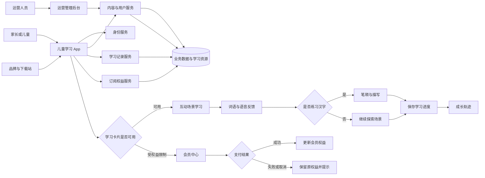
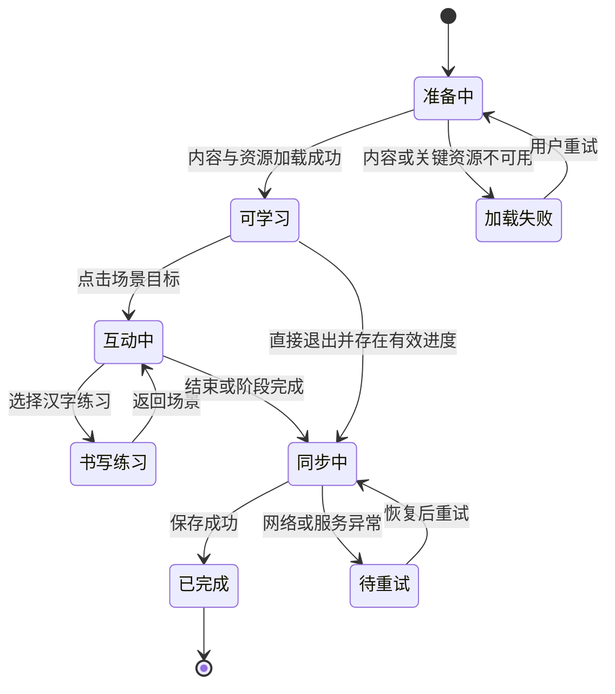
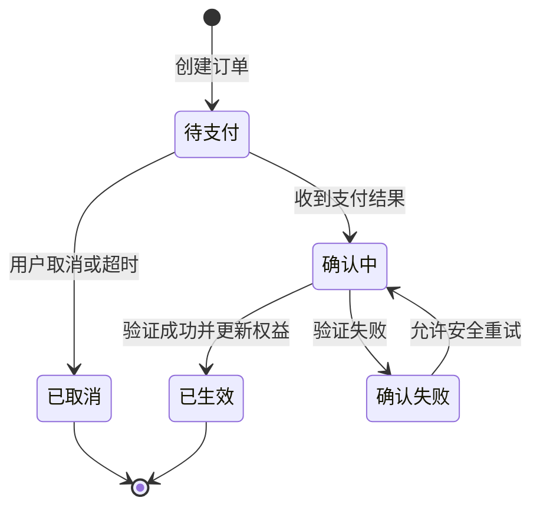
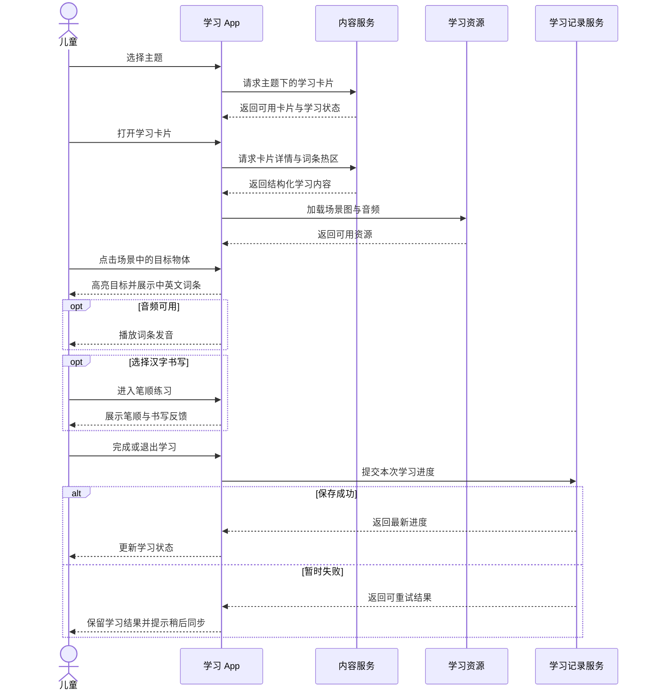
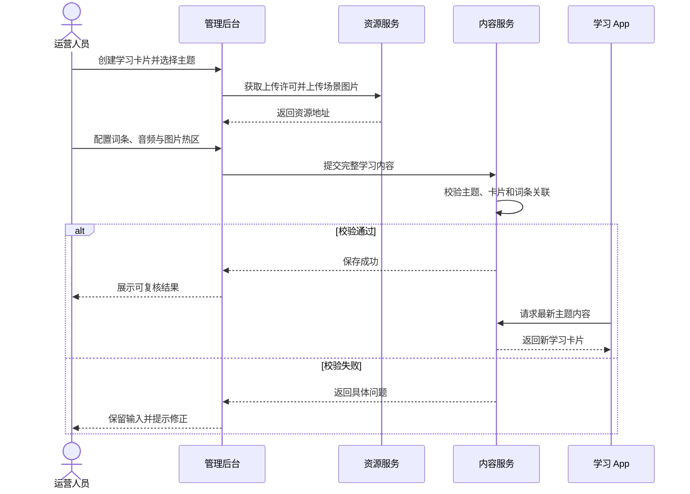
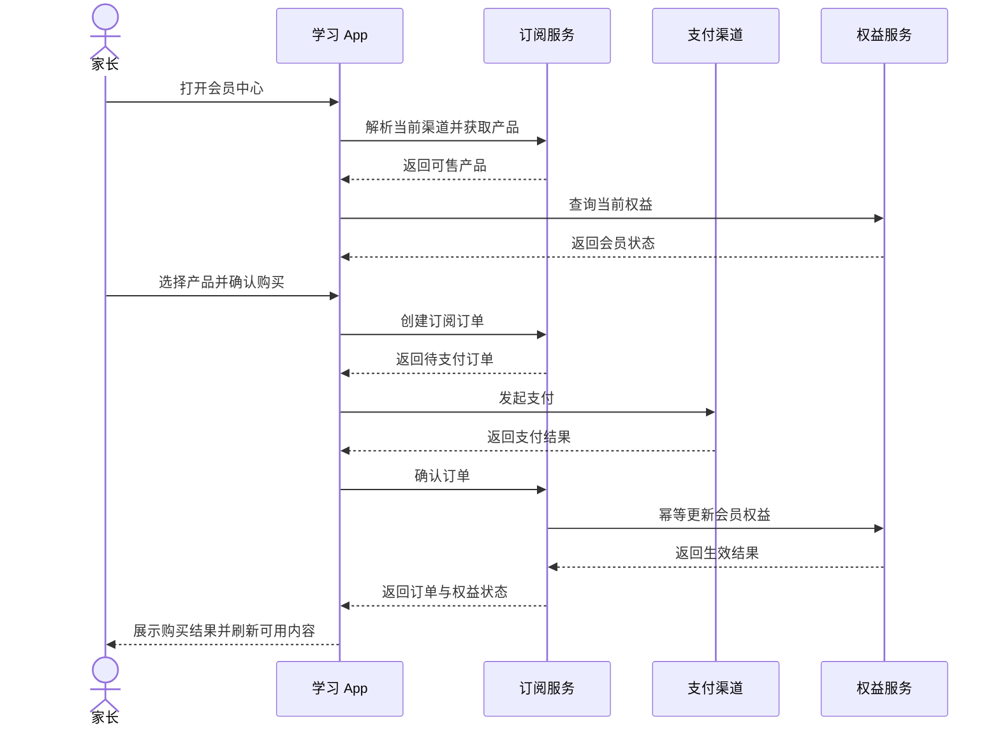

# Hi Kiki 业务逻辑框架

> 版本：1.0  
> 更新日期：2026-07-12  
> 文档目的：描述 Hi Kiki 的业务模块、核心流程、状态变化、异常策略与关键时序。

## 1. 整体逻辑框架

Hi Kiki 围绕“内容生产—儿童学习—进度沉淀—成长反馈—订阅转化”形成闭环：运营人员生产结构化学习内容，儿童在移动端消费内容并完成互动，业务服务保存身份、内容、学习与权益数据，家长通过成长信息了解学习结果，品牌下载站承担获客与版本触达。

## 2. 业务模块关系

| 业务模块 | 核心职责 | 主要输入 | 主要输出 |
|---|---|---|---|
| 身份与用户 | 注册、登录、身份校验、个人资料 | 用户凭据、资料更新 | 登录凭证、用户身份 |
| 学习内容 | 主题、卡片、词条、热区和推荐 | 运营配置、搜索条件 | 可学习的结构化内容 |
| 互动学习 | 场景浏览、热点点击、语音、笔顺 | 学习内容、儿童操作 | 即时学习反馈 |
| 学习记录 | 记录卡片进度并生成汇总 | 学习行为、用户身份 | 进度明细、成长汇总 |
| 订阅权益 | 产品匹配、订单、确认、权益 | 地区平台渠道、支付结果 | 订单状态、VIP 权益 |
| 反馈运营 | 收集问题并追踪处理 | 用户反馈、运营处理 | 反馈记录和处理状态 |
| 内容运营 | 维护主题、卡片、词条、资源 | 运营输入、图片音频 | 移动端可消费内容 |
| 品牌发布 | 产品介绍、下载、版本触达 | 发布内容、版本信息 | 官网页面和更新信息 |

## 3. 主流程描述

### 3.1 启动与进入学习

1. 用户启动 App，系统初始化本地状态、显示模式和必要服务。
2. 系统检查现有登录状态；有效则进入学习首页，无效则进入身份入口。
3. 用户完成登录或注册，身份服务返回可验证的登录状态。
4. 学习首页请求主题与必要的用户信息，并展示可进入的学习入口。

### 3.2 互动学习与进度沉淀

1. 儿童选择主题，系统读取对应学习卡片。
2. 儿童打开卡片，系统获取场景图、词条、热区、音频及相关学习配置。
3. 儿童点击物体，界面匹配目标热区并展示中英文学习反馈。
4. 用户可重复播放发音，或针对汉字进入笔顺练习。
5. 用户继续探索或结束学习，系统汇总本次进度。
6. 学习记录服务保存进度，成长页通过记录明细生成学习汇总。

### 3.3 内容生产与发布

1. 运营人员登录管理后台。
2. 运营人员创建或维护主题，确定内容组织方式。
3. 运营人员创建学习卡片，上传场景图片并填写展示信息。
4. 运营人员为图片配置词条、热区、音频等学习要素。
5. 系统校验内容完整性并保存。
6. 移动端再次请求内容时读取符合展示条件的最新数据。

### 3.4 订阅购买与权益生效

1. 用户进入会员中心，系统识别地区、设备平台、分发渠道和登录来源。
2. 订阅服务返回适用于当前上下文的产品与用户已有权益。
3. 用户选择产品并发起购买，系统创建待处理订单。
4. 外部支付流程返回结果后，App 发起订单确认。
5. 订阅服务验证订单并以幂等方式更新订单和权益。
6. App 刷新权益，成功时开放对应内容；失败或取消时保留原状态。

## 4. 关键业务规则

- 当用户没有有效登录状态时，需要身份的学习记录、个人资料和订阅权益不可访问。
- 当主题不可用或没有可展示卡片时，移动端不得展示无效学习入口。
- 当儿童点击位置落在多个热区时，应使用明确且稳定的匹配优先级，避免一次点击触发多个词条。
- 当词条音频缺失或播放失败时，文字与图片学习必须继续可用。
- 当场景详情加载失败时，不记录虚假学习进度。
- 当同一用户同一卡片多次上报进度时，应更新或合并既有进度，避免产生相互冲突的重复记录。
- 当 App 从后台恢复且此前停留在学习详情时，回到卡片列表层级，降低状态和资源失效造成的异常。
- 当订阅订单被重复确认时，权益更新必须保持幂等。
- 当产品与当前地区、平台或渠道不匹配时，不向用户提供购买入口。
- 当管理员删除存在关联内容的主题或卡片时，应拒绝删除或采用可追溯的停用策略。
- 当资源上传完成但业务内容保存失败时，应提示运营人员重试，并避免把未绑定资源当作已发布内容。

## 5. 状态流转

### 5.1 学习会话状态

### 5.2 订阅订单状态

## 6. 异常流程与降级策略

| 异常场景 | 处理策略 | 用户可见影响 |
|---|---|---|
| 本地初始化超时 | 跳过非关键初始化并继续启动 | 启动略有延迟，核心入口仍可使用 |
| 登录状态失效 | 清理无效状态并回到登录入口 | 需要重新登录 |
| 主题或卡片加载失败 | 保留当前页并提供重试 | 暂时无法进入对应内容 |
| 场景图片失败 | 显示占位和重试，不允许误触热区 | 暂时无法进行图像互动 |
| 单个音频失败 | 保留文字、图片与其他操作 | 当前发音不可播放 |
| 笔顺资源缺失 | 隐藏或禁用笔顺播放，保留返回 | 仍可识字但不能观看笔顺 |
| 学习进度同步失败 | 保留待同步状态，在安全时机重试 | 进度可能延迟显示 |
| 支付取消或失败 | 不改变权益，明确展示结果 | 用户可重新购买 |
| 重复订单确认 | 返回既有确认结果，不重复发放权益 | 用户看到稳定结果 |
| 后台内容保存失败 | 保留编辑输入并提示重试 | 新内容暂不对移动端生效 |
| 资源上传失败 | 允许重新上传，不提交不完整内容 | 运营流程中断但数据不污染 |

## 7. 关键场景时序图

### 7.1 儿童完成一次场景学习

### 7.2 运营人员发布一张学习卡片

### 7.3 VIP 购买与权益刷新

## 8. 架构影响与演进建议

- 当前产品跨移动端、后端、后台和静态站，主题、卡片、词条、用户、进度与权益应保持清晰的业务边界，避免一个模块直接修改另一模块的数据语义。
- 移动端应继续保持界面、业务规则、数据访问和基础设施之间的单向依赖，以便场景学习、成长轨迹和订阅模块独立演进。
- 内容发布建议补充“草稿—待校验—已发布—已停用”生命周期，使后台保存与移动端可见不再等价，降低误发布风险。
- 学习进度建议形成统一的事件与幂等规则，支持离线重试、多设备同步和更准确的成长汇总。
- 订阅链路需要持续保持订单、支付凭证和权益三者可审计，且任何重试都不应重复发放权益。
- 共享接口文档存在部分历史口径与当前实现不一致的迹象，后续应以实际路由与数据库事实源做专项契约对齐。

