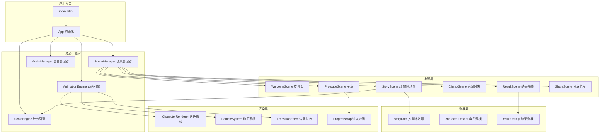
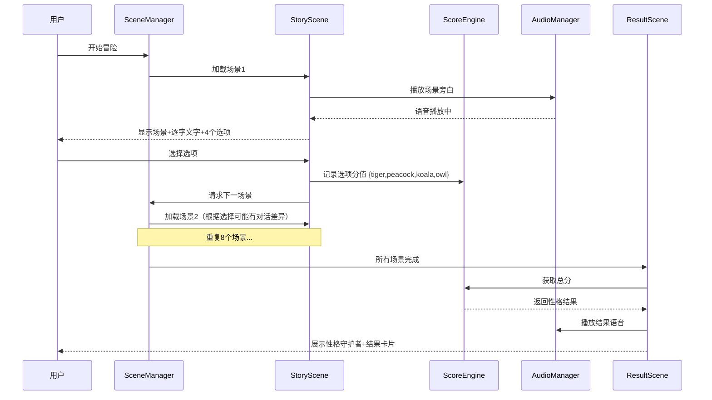

## 产品概述

一款面向6-12岁儿童的PDP动物性格测试应用，以"魔法森林大冒险"为故事主题，通过互动式场景剧让儿童在冒险中完成性格测评。应用兼容微信小程序（web-view套壳）和网页端，包含语音讲解、精美动画和分支剧情，营造沉浸式体验。

## 核心功能

### 1. 互动式场景剧测评

- 故事背景：魔法森林中四位动物守护者（老虎·勇勇、孔雀·彩彩、考拉·暖暖、猫头鹰·慧慧）守护着四块性格宝石，黑暗迷雾来袭，玩家需帮助守护者找回宝石拯救森林
- 包含完整起承转合：序章（进入森林、认识守护者）→ 冒险（8个场景选择关卡）→ 高潮（黑暗迷雾对决）→ 结局（揭晓性格、获得守护者祝福）
- 每个场景提供4个选择项，分别对应老虎型（行动力）、孔雀型（社交力）、考拉型（同理心）、猫头鹰型（思考力），选择影响后续剧情走向和对话内容

### 2. PDP性格测试系统

- 基于PDP四型人格模型（老虎/孔雀/考拉/猫头鹰），题目转化为8道情境式选择场景
- 采用加权积分算法，计算四种性格维度得分，输出主性格+副性格组合结果
- 结果页展示对应动物守护者形象、性格特质描述、优势与成长建议（正向鼓励措辞）

### 3. 语音讲解系统

- 全程语音旁白：序章引入、每个场景的故事描述、选项讲解、结果揭晓均配有语音
- 使用Web Speech API实现前端语音合成，支持语速/音调调节
- 提供语音开关控制，适配不同使用场景

### 4. 视觉与动画体验

- 卡通手绘风格，明亮温暖色调，大圆角设计，符合儿童审美认知
- 场景切换动画、角色出场动画、选项交互动画、粒子特效
- 四位守护者角色采用SVG绘制，支持简单表情动画
- 进度可视化：魔法地图显示冒险进度

### 5. 多端兼容

- 纯HTML5实现，零框架依赖，确保微信小程序web-view和各浏览器兼容
- 响应式布局，适配手机竖屏为主，同时兼容PC端横屏
- 触屏友好的大按钮交互区域

### 6. 结果分享

- 生成精美的性格结果卡片（Canvas绘制）
- 支持长按保存图片，便于分享到朋友圈

## 技术栈

- **前端框架**：纯HTML5 + CSS3 + Vanilla JavaScript（零依赖，最大化兼容性）
- **动画方案**：CSS3 Animation + CSS Transition + Canvas 2D（角色绘制与粒子特效）
- **语音方案**：Web Speech API（SpeechSynthesis）
- **结果卡片**：Canvas 2D 绘制并导出为图片
- **构建工具**：无需构建，直接运行静态文件
- **部署方式**：静态文件托管，微信小程序通过 web-view 加载

## 实现方案

### 整体策略

采用单页应用（SPA）架构，通过自研轻量级场景管理器控制页面切换。整个应用由一个 HTML 文件 + 模块化的 JS/CSS 文件组成，场景以状态机模式管理，每个游戏场景对应一个 Scene 对象。剧本数据与渲染逻辑完全分离，剧本以 JSON 数据结构定义，渲染引擎根据数据动态生成 UI。

### 关键技术决策

1. **零依赖架构**：不引入任何第三方框架或库，确保在微信小程序 web-view 中的兼容性最大化，同时减小加载体积（目标 < 500KB 总体积）。所有动画使用 CSS3 + requestAnimationFrame 实现。

2. **场景状态机**：设计 SceneManager 管理场景生命周期（enter/update/exit），支持场景栈实现前进/回退。每个场景独立管理自己的 DOM 和事件，切换时执行动画过渡。

3. **剧本数据驱动**：剧本以结构化 JSON 定义（场景描述、对话序列、选项分支、分值映射），编剧内容与代码完全解耦。支持条件分支（根据已有选择动态改变后续对话和场景表现）。

4. **性格算法**：采用四维向量累积法。每个选项携带 `{tiger, peacock, koala, owl}` 四维分值，8道题后累加得到总分向量，最高分为主性格，次高分为副性格。支持16种组合结果（4主 x 4副，排除同型）。

5. **语音合成策略**：使用 `window.speechSynthesis` API，优先选择中文女声。对不支持的浏览器做静默降级（仅显示文字无语音）。语音播放与文字逐字显示同步联动，营造"讲故事"效果。

6. **Canvas 角色系统**：四位守护者使用 Canvas 2D 绘制（程序化生成简笔画风格角色），支持简单帧动画（眨眼、摆手、跳跃），避免大量图片资源依赖。

### 性能与兼容性保障

- 所有图形资源程序化生成（Canvas/CSS），避免大图加载延迟
- 场景预加载：当前场景展示时，后台预渲染下一场景的 DOM
- CSS 动画使用 `transform` 和 `opacity` 触发 GPU 合成，避免重排
- 触屏事件使用 `touchstart`/`touchend` + `click` 双重绑定，解决 300ms 延迟
- 使用 `<meta name="viewport">` 配合 `rem` 单位实现响应式，以 375px 为基准

### 实现注意事项

- Web Speech API 在部分安卓微信 web-view 中可能不可用，需做特性检测并优雅降级
- Canvas 绘制需处理高清屏 DPR 缩放（`devicePixelRatio`），避免模糊
- 逐字显示效果使用 `requestAnimationFrame` 而非 `setInterval`，确保流畅
- 场景切换使用 CSS `animation` 而非 JS 动画，减少主线程负担
- 结果卡片生成需等待 Canvas 内容完全绘制后再 `toDataURL`，使用 Promise 封装异步流程
- 在微信环境中长按保存图片需将 Canvas 转为 `` 标签的 src

## 系统架构



### 数据流



## 目录结构

```
/Users/yangyong/CodeBuddy/pdp/
├── index.html                      # [NEW] 应用入口页，包含基础HTML结构、viewport配置、资源引用、loading画面
├── css/
│   ├── reset.css                   # [NEW] 样式重置，统一各浏览器默认样式，设置rem基准
│   ├── variables.css               # [NEW] CSS变量定义：色彩系统、字体系统、间距系统、动画时长
│   ├── animations.css              # [NEW] 全局动画定义：场景转场、元素入场、角色动作、粒子运动、按钮反馈等keyframes
│   ├── components.css              # [NEW] 通用UI组件样式：按钮、对话框、进度条、选项卡片、浮动气泡
│   └── scenes.css                  # [NEW] 各场景专属样式：欢迎页、序章、冒险场景、高潮、结果页、分享页的布局与装饰
├── js/
│   ├── app.js                      # [NEW] 应用入口，初始化各引擎模块、注册场景、启动应用、处理全局事件
│   ├── core/
│   │   ├── SceneManager.js         # [NEW] 场景管理器：场景栈管理、生命周期控制(init/enter/update/exit)、转场动画调度
│   │   ├── AudioManager.js         # [NEW] 语音管理器：Web Speech API封装、语音队列、逐字同步回调、开关控制、降级处理
│   │   ├── AnimationEngine.js      # [NEW] 动画引擎：requestAnimationFrame主循环、动画注册/更新/销毁、缓动函数库
│   │   └── ScoreEngine.js          # [NEW] 计分引擎：四维分值累积、主副性格计算、结果映射、历史记录存储(localStorage)
│   ├── scenes/
│   │   ├── WelcomeScene.js         # [NEW] 欢迎场景：标题动画、魔法森林背景、开始按钮、音频权限获取
│   │   ├── PrologueScene.js        # [NEW] 序章场景：故事背景介绍、四位守护者依次登场、魔法地图首次展示
│   │   ├── StoryScene.js           # [NEW] 冒险场景（通用）：根据剧本数据动态渲染场景描述、角色对话、四选项交互、选择反馈动画
│   │   ├── ClimaxScene.js          # [NEW] 高潮场景：黑暗迷雾对决演出、根据累积选择展示专属守护者援助、戏剧性转场
│   │   ├── ResultScene.js          # [NEW] 结果场景：性格揭晓动画、守护者祝福语、性格特质详情、成长建议展示
│   │   └── ShareScene.js           # [NEW] 分享场景：Canvas绘制结果卡片、长按保存提示、再测一次入口
│   ├── renderers/
│   │   ├── CharacterRenderer.js    # [NEW] 角色绘制器：Canvas程序化绘制四位守护者形象、表情动画帧、动作状态切换
│   │   ├── BackgroundRenderer.js   # [NEW] 背景绘制器：各场景背景（森林/河流/山洞/星空等）的Canvas渐变+装饰绘制
│   │   ├── ParticleSystem.js       # [NEW] 粒子系统：魔法粒子、星光、落叶、萤火虫等粒子效果，支持多种预设模式
│   │   └── CardRenderer.js         # [NEW] 结果卡片绘制：Canvas生成可分享的性格卡片图片，含角色、文字、装饰边框
│   ├── data/
│   │   ├── storyData.js            # [NEW] 剧本数据：8个冒险场景的完整定义（描述文本、旁白文本、4选项及对应分值、条件分支对话）
│   │   ├── characterData.js        # [NEW] 角色数据：四位守护者的名称、性格描述、绘制参数、台词库、颜色配置
│   │   ├── resultData.js           # [NEW] 结果数据：16种性格组合的结果文案（特质描述、优势、成长建议、守护者祝福语）
│   │   └── dialogData.js           # [NEW] 对话数据：序章/高潮/结局的剧情对话序列，含角色表情和动作指令
│   └── utils/
│       ├── dom.js                  # [NEW] DOM工具：元素创建/查询/样式操作的简写封装、事件委托、安全innerHTML
│       ├── device.js               # [NEW] 设备检测：微信环境判断、屏幕尺寸、DPR、触屏支持、Speech API支持检测
│       └── easing.js               # [NEW] 缓动函数集合：easeInOut/bounce/elastic等，供动画引擎使用
└── miniapp/
    ├── app.json                    # [NEW] 小程序配置：页面路由、窗口配置、权限声明
    ├── app.js                      # [NEW] 小程序入口：生命周期、全局数据
    ├── app.wxss                    # [NEW] 小程序全局样式
    └── pages/
        └── webview/
            ├── webview.wxml        # [NEW] web-view页面模板：承载H5的web-view组件
            ├── webview.js          # [NEW] web-view页面逻辑：URL配置、消息通信、分享配置
            └── webview.wxss        # [NEW] web-view页面样式
```

## 关键代码结构

```typescript
// SceneManager 场景管理器接口
interface Scene {
  id: string;
  init(container: HTMLElement): void;      // 初始化DOM结构
  enter(data?: any): Promise<void>;         // 进入场景，执行入场动画
  update?(deltaTime: number): void;         // 帧更新（可选）
  exit(): Promise<void>;                    // 退出场景，执行离场动画
  destroy(): void;                          // 销毁，释放资源
}

// 剧本数据结构
interface StoryScene {
  id: string;
  background: string;                       // 背景类型标识
  narration: string;                        // 旁白文本（语音+逐字显示）
  character?: string;                       // 出场角色ID
  dialogue?: DialogLine[];                  // 角色对话序列
  options: StoryOption[];                   // 四个选择项
  conditionalDialogue?: Record<string, DialogLine[]>;  // 基于历史选择的条件对话
}

interface StoryOption {
  text: string;                             // 选项文字
  icon: string;                             // 选项图标标识
  scores: { tiger: number; peacock: number; koala: number; owl: number };
  feedback: string;                         // 选择后的即时反馈文本
  nextSceneVariant?: string;                // 影响下一场景的变体标识
}

// 性格结果数据结构
interface PersonalityResult {
  primary: 'tiger' | 'peacock' | 'koala' | 'owl';
  secondary: 'tiger' | 'peacock' | 'koala' | 'owl';
  scores: { tiger: number; peacock: number; koala: number; owl: number };
  title: string;                            // 结果标题，如"勇敢的小老虎"
  traits: string[];                         // 性格特质列表
  strengths: string;                        // 优势描述
  growth: string;                           // 成长建议
  blessing: string;                         // 守护者祝福语
}
```

## 整体设计风格

采用"童话绘本"视觉风格，营造一个温暖梦幻的魔法森林世界。整体设计以手绘插画质感为基础，运用柔和的渐变色彩、大量圆角元素和丰富的微动画，让儿童感受到进入了一本会动的故事书。所有UI元素都经过儿童认知优化：大尺寸触摸区域（最小48px）、清晰的视觉层级、积极正向的色彩情绪。

## 设计原则

- 圆润柔和：所有元素使用大圆角（16-24px），避免尖角和硬边
- 层次丰富：使用柔和阴影和玻璃态效果营造深度，背景-中景-前景三层视差
- 动态活泼：微交互动画贯穿全程（按钮呼吸、角色眨眼、粒子漂浮、文字弹入）
- 无障碍友好：高对比度文字、大按钮、语音辅助，确保儿童独立操作

## 页面设计

### 页面1：欢迎页

- 顶部区块：满屏魔法森林背景，使用深绿到星空蓝的渐变，散布漂浮的萤火虫粒子光点
- 中部区块：应用标题"魔法森林大冒险"以金色描边大字居中展示，带轻柔上下浮动动画；副标题"发现你的动物守护者"以白色圆润字体显示
- 角色预览区块：四位守护者的小头像以半圆形排列在标题下方，各自带有轻微的左右摇晃动画，悬浮光环效果
- 底部区块：大号圆形渐变按钮"开始冒险"，带持续的呼吸光晕脉冲动画，按下有弹性缩放反馈；下方小字"适合6-12岁小朋友"

### 页面2：序章/故事引入

- 顶部导航区块：透明背景导航条，左侧语音开关图标（喇叭形状），右侧显示"序章"标识
- 故事展示区块：占屏幕上部60%，以卷轴/书页形态展示故事背景文字，文字逐字出现配合语音朗读，底部有半透明渐隐效果
- 角色登场区块：当介绍到某位守护者时，角色从画面侧方滑入，伴随星光粒子特效，角色下方显示名字标签
- 继续按钮区块：底部"继续"按钮在文字完全显示后以渐显+上滑动画出现

### 页面3：冒险场景（核心交互页，共8个场景复用）

- 场景背景区块：全屏场景背景画面（森林小径/河流边/神秘山洞/星光草地等），使用Canvas渐变+装饰元素绘制，带缓慢视差滚动效果
- 叙事对话区块：屏幕上部半透明毛玻璃对话框，左侧角色头像（圆形带彩色边框），右侧逐字显示的对话文本，对话框有柔和的弹入动画
- 进度指示区块：屏幕顶部魔法地图缩略条，用发光小点标记已完成/当前/未完成的关卡位置
- 选项交互区块：屏幕下部40%区域，四个选项以2x2网格排列，每个选项为带图标的圆角卡片（渐变背景色），选项卡片入场时依次弹入（间隔100ms），触摸时卡片浮起+发光边框效果，选择后该选项卡片放大高亮并弹出反馈气泡文字

### 页面4：高潮对决

- 黑暗迷雾区块：背景从明亮渐变为暗色调，紫色/深蓝迷雾粒子从四周涌入，营造紧张感
- 对决演出区块：中央展示黑暗迷雾实体，玩家的专属守护者从光芒中显现，上演简短的对抗动画序列
- 能量汇聚区块：四块宝石发光汇聚效果，守护者释放对应颜色的能量驱散迷雾
- 胜利转场区块：迷雾消散，画面恢复明亮，彩虹光弧横跨屏幕，粒子烟花绽放

### 页面5：结果揭晓

- 守护者亮相区块：专属守护者大幅形象居中展示，从光柱中缓缓下降出场，周围环绕对应颜色的魔法光环和粒子效果
- 性格标题区块：大号金色标题显示结果名称（如"勇敢的小老虎"），下方显示对应星座式的简短性格标签
- 特质详情区块：可滚动区域，以精美卡片形式展示性格特质列表（每个特质一个小图标+简短描述）、"你的超能力"优势描述、"成长小秘密"建议文段
- 守护者祝福区块：底部半透明对话框显示守护者的祝福语，配合语音朗读
- 操作按钮区块：两个按钮并排——"查看我的卡片"（进入分享页）和"再测一次"

### 页面6：分享卡片页

- 卡片展示区块：屏幕中央展示Canvas生成的精美结果卡片，卡片设计包含守护者形象、性格名称、特质关键词、装饰性魔法边框、应用二维码水印
- 操作提示区块：卡片下方提示"长按图片保存到相册"，配一个保存图标
- 返回区块：底部"重新冒险"按钮返回欢迎页

## Agent Extensions

### Skill

- **brainstorming**
- 用途：在剧本创作和角色设计阶段，通过头脑风暴探索最优的故事主题、场景设计、角色性格特征和游戏机制
- 预期产出：完整的"魔法森林大冒险"故事大纲、8个场景创意、四位守护者角色设定

- **ui-ux-pro-max**
- 用途：指导整体UI/UX设计决策，确保儿童友好的视觉风格、交互模式和色彩系统的专业性
- 预期产出：高质量的视觉设计规范、组件样式方案、动画交互细节

- **subagent-driven-development**
- 用途：协调多个子代理并行开发独立模块（核心引擎、场景实现、数据编写、渲染器），提高开发效率
- 预期产出：各模块并行完成并集成为完整应用

- **verification-before-completion**
- 用途：在每个阶段完成后验证功能完整性、跨端兼容性和视觉效果
- 预期产出：经过验证的可交付应用，确保质量达标

- **writing-plans**
- 用途：在实现前制定详细的多步骤实施计划，确保有序推进
- 预期产出：结构化的实施路线图

### SubAgent

- **code-explorer**
- 用途：在开发过程中检索和验证代码结构、模块依赖关系
- 预期产出：确保模块间接口一致性和代码质量